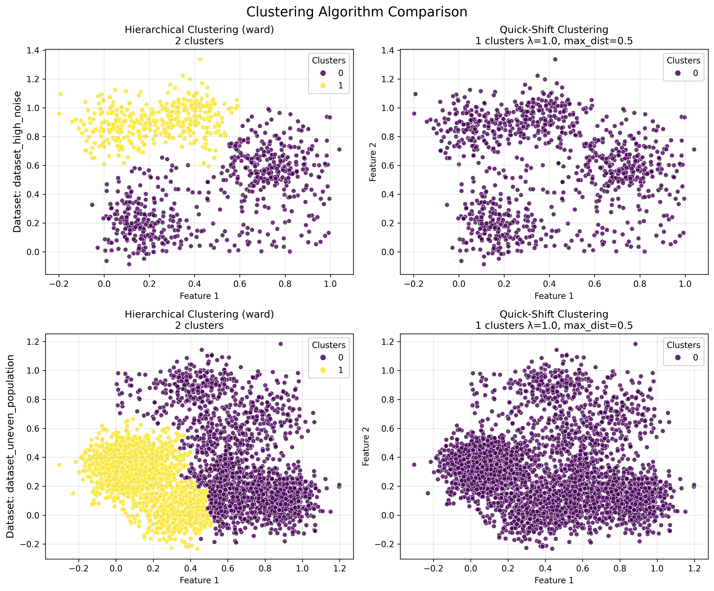

# PyPAMM Examples Documentation

This document provides an overview of the example scripts included in the PyPAMM package, along with explanations of their outputs and usage. These examples demonstrate how to use the various algorithms and functions in the package for data analysis and clustering.

## Table of Contents

1. [Grid Selection](#grid-selection)
2. [Neighbor Graph](#neighbor-graph)
3. [Quick Shift Clustering](#quick-shift-clustering)
4. [Minimum Spanning Tree (MST)](#minimum-spanning-tree-mst)
5. [Complete Pipeline](#complete-pipeline)
6. [Running the Examples](#running-the-examples)

## Grid Selection

**File:** `examples/grid_selection_example.py`

### Purpose

The grid selection algorithm divides the space into a grid and selects representative points from each occupied grid cell. This creates a more uniform distribution of points while preserving the overall structure of the data.

### Key Features

- Reduces the number of points in large datasets
- Creates a more uniform distribution of points
- Preserves the overall structure of the data
- Speeds up subsequent computations

### Example Code

```python
import numpy as np
from pypamm import select_grid_points

# Generate data
X = np.random.rand(1000, 2) * 10

# Select grid points
grid_indices, grid_points = select_grid_points(X, ngrid=20)

print(f"Original data: {X.shape[0]} points")
print(f"Selected grid points: {grid_points.shape[0]} points")
```

### Expected Output

The script generates a visualization showing:
- The original dataset (1000 points)
- Grid selection with different grid sizes (10, 20, 50)
- The selected grid points highlighted in red


As the grid size (ngrid) increases:
- More grid cells are created
- More points are selected
- The selected points better represent the fine structure of the data
- But computational cost for subsequent algorithms increases

### When to Use

- When dealing with large datasets that need to be reduced
- When you need a more uniform distribution of points
- As a preprocessing step for clustering or graph-building algorithms

## Neighbor Graph

**File:** `examples/neighbor_graph_example.py`

### Purpose

Neighbor graphs capture the connectivity structure of data by connecting points based on various criteria. Different graph types provide different trade-offs between sparsity and connectivity.

### Graph Types

1. **K-Nearest Neighbors (KNN)**
   - Connects each point to its k nearest neighbors
   - Simple and efficient, but can create disconnected components
   - Good for local structure, but may miss global structure
   - Parameter k controls the density of connections

2. **Gabriel Graph**
   - Two points are connected if no other point lies in the circle with diameter defined by the two points
   - Captures both local and global structure
   - No parameters to tune
   - Tends to create more connections than RNG but fewer than Delaunay

3. **Relative Neighborhood Graph (RNG)**
   - Two points are connected if no other point is closer to both of them
   - Creates a sparser graph than Gabriel
   - Preserves important structural features
   - No parameters to tune

4. **Delaunay Triangulation**
   - Creates a triangulation where no point is inside the circumcircle of any triangle
   - Creates the densest graph among these options
   - Captures global structure well
   - No parameters to tune
   - Often used as a starting point for other graph algorithms

### Example Code

```python
import numpy as np
from pypamm import build_neighbor_graph, build_knn_graph

# Generate data
X = np.random.rand(200, 2) * 10

# Build different graph types
knn_graph = build_knn_graph(X, k=5)
gabriel_graph = build_neighbor_graph(X, graph_type="gabriel")
rng_graph = build_neighbor_graph(X, graph_type="relative_neighborhood")
delaunay_graph = build_neighbor_graph(X, graph_type="delaunay")
```

### Expected Output

The script generates a visualization showing:
- Four different graph types (KNN, Gabriel, RNG, Delaunay)
- Points and edges for each graph
- Statistics about each graph (number of edges, average node degree, graph density)


### When to Use

- **KNN**: When you need control over the number of connections
- **Gabriel/RNG**: When you want a balance between sparsity and connectivity
- **Delaunay**: When you need a comprehensive graph that captures all relationships

## Quick Shift Clustering

**File:** `examples/quick_shift_example.py`

### Purpose

Quick Shift is a mode-seeking clustering algorithm that:
1. Estimates the density of the data points
2. Shifts each point towards the nearest neighbor with higher density
3. Forms clusters by connecting points that shift to the same mode

### Key Features

- Automatically determines the number of clusters
- Can find clusters of arbitrary shape
- Robust to noise and outliers
- Based on density estimation, which is intuitive

### Key Parameters

- **lambda_qs**: Controls the tradeoff between density and distance
  - Smaller values prioritize density (more clusters)
  - Larger values prioritize distance (fewer clusters)
- **max_dist**: Maximum distance threshold for connecting points
  - Limits the maximum shift distance
  - Helps prevent connecting distant clusters
- **ngrid**: Number of grid points for density estimation
  - Higher values provide more accurate density estimation

### Example Code

```python
import numpy as np
from scipy.stats import gaussian_kde
from pypamm import quick_shift

# Generate data
X = np.random.rand(600, 2) * 10

# Estimate density
kde = gaussian_kde(X.T)
prob = kde(X.T)
prob = prob / np.max(prob)  # Normalize to [0, 1]

# Run Quick Shift clustering
cluster_labels, cluster_centers = quick_shift(
    X, 
    prob=prob, 
    ngrid=50, 
    lambda_qs=1.0, 
    max_dist=3.0
)
```

### Expected Output

The script generates a visualization showing:
- The original data colored by density
- Clustering results with different lambda values (0.5, 1.0, 2.0)
- Points colored by cluster assignment
- Cluster centers marked with stars



### When to Use

- When the number of clusters is unknown
- When clusters have arbitrary shapes
- When dealing with noisy data
- When density-based clustering is appropriate

## Minimum Spanning Tree (MST)

**File:** `examples/mst_example.py`

### Purpose

A Minimum Spanning Tree (MST) is a subset of the edges of a connected, edge-weighted graph that connects all vertices together without cycles while minimizing the total edge weight.

### Key Properties

- Contains exactly N-1 edges for N points
- Has no cycles (it's a tree)
- Connects all points (it's spanning)
- Has minimum total edge weight among all spanning trees

### Example Code

```python
import numpy as np
from pypamm import build_mst

# Generate data
X = np.random.rand(300, 2) * 10

# Build MST with different distance metrics
euclidean_mst = build_mst(X, metric="euclidean")
manhattan_mst = build_mst(X, metric="manhattan")
chebyshev_mst = build_mst(X, metric="chebyshev")
```

### Expected Output

The script generates visualizations showing:
- The original data
- MST with different distance metrics (Euclidean, Manhattan, Chebyshev)
- MST on grid-selected points for a larger dataset


### Applications

1. **Clustering**
   - By removing the longest edges, the MST can be split into clusters
   - Useful for identifying natural groupings in the data

2. **Dimensionality Reduction**
   - MST preserves the local structure of the data
   - Can be used as a preprocessing step for manifold learning

3. **Outlier Detection**
   - Points connected by unusually long edges may be outliers
   - The distribution of edge weights can reveal anomalies

4. **Feature Extraction**
   - Properties of the MST (e.g., average edge weight, degree distribution)
   - Can be used as features for machine learning

5. **Efficient Data Representation**
   - MST provides a sparse representation of the data
   - Useful for large datasets where full pairwise distances are expensive

### Distance Metrics and Their Effects

- **Euclidean**: Standard straight-line distance, good for most applications
- **Manhattan**: Sum of absolute differences, sensitive to axis alignment
- **Chebyshev**: Maximum difference along any dimension, creates more direct paths

## Complete Pipeline

**File:** `examples/pipeline_example.py`

### Purpose

This example demonstrates how to combine multiple PyPAMM algorithms in a pipeline for data analysis and clustering.

### Pipeline Steps

1. **Data Generation**
   - Create a synthetic dataset with complex structure
   - Multiple clusters with different shapes and noise

2. **Grid Selection**
   - Reduce the dataset from 1000 to ~200 points
   - Preserve the overall structure while making computation more efficient

3. **Neighbor Graph**
   - Build a Gabriel graph on the grid points
   - Capture the connectivity structure of the data
   - Understand relationships between points

4. **Minimum Spanning Tree**
   - Build an MST on the grid points
   - Provide a sparse representation of the data
   - Connect all points with minimum total edge weight

5. **Density Estimation**
   - Estimate the density of the grid points using KDE
   - Higher density indicates regions with more points

6. **Quick Shift Clustering**
   - Use the density information to find clusters
   - Automatically determine the number of clusters
   - Identify cluster centers at density modes

### Example Code

```python
import numpy as np
from scipy.stats import gaussian_kde
from pypamm import select_grid_points, build_neighbor_graph, build_mst, quick_shift

# Generate data
X = np.random.rand(1000, 2) * 10

# Step 1: Select grid points
grid_indices, grid_points = select_grid_points(X, ngrid=30)

# Step 2: Build neighbor graph
graph = build_neighbor_graph(grid_points, graph_type="gabriel")

# Step 3: Build MST
mst_edges = build_mst(grid_points)

# Step 4: Estimate density
kde = gaussian_kde(grid_points.T)
prob = kde(grid_points.T)
prob = prob / np.max(prob)  # Normalize to [0, 1]

# Step 5: Run Quick Shift clustering
cluster_labels, cluster_centers = quick_shift(
    grid_points, 
    prob=prob, 
    ngrid=20, 
    lambda_qs=1.0, 
    max_dist=3.0
)
```

### Expected Output

The script generates a visualization showing:
1. The original data
2. Grid selection results
3. Gabriel graph on grid points
4. Quick Shift clustering with MST


### Advantages of this Pipeline

- Handles large datasets efficiently through grid selection
- Captures complex data structures with appropriate graph types
- Finds clusters of arbitrary shape using density-based methods
- Provides a hierarchical view of the data through the MST
- Requires minimal parameter tuning

## Running the Examples

To run these examples, make sure you have PyPAMM installed:

```bash
# From the root directory of the repository
poetry install
```

Then you can run any example using Poetry:

```bash
poetry run python examples/grid_selection_example.py
poetry run python examples/neighbor_graph_example.py
poetry run python examples/quick_shift_example.py
poetry run python examples/mst_example.py
poetry run python examples/pipeline_example.py
```

Each example generates visualizations that are saved as PNG files in the current directory. The examples also print explanations and statistics to the console to help understand the algorithms and their parameters.

## Dependencies

These examples require the following dependencies (automatically installed with PyPAMM):

- NumPy
- SciPy
- Matplotlib 